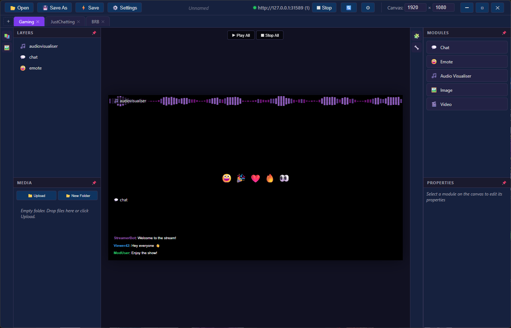
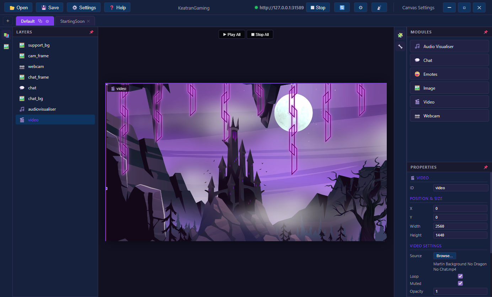
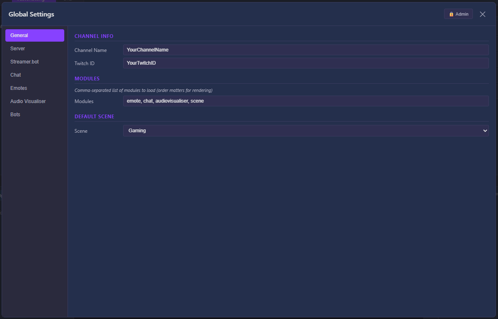
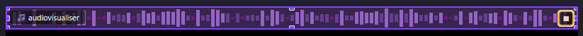
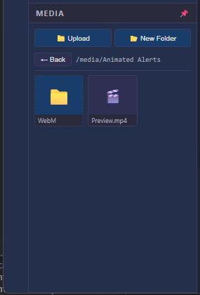
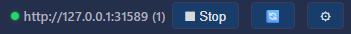

# CanvasUI Stream Manager

A fully local StreamElements alternative that renders overlays in real time using Canvas. No cloud, no lag.
Uses Streamer.bot to drive real-time events and automation, design scenes and render chat, emotes, audio visualisers, images, and videos as browser source overlays in OBS with a built-in desktop editor.

<!-- SCREENSHOT: Main editor window with a scene loaded showing the canvas with modules, layers panel, and properties panel -->


## Features

- **Visual Scene Editor** — Drag and drop modules onto a canvas, resize and position them visually
- **Multi-Scene Support** — Create different layouts for Gaming, Just Chatting, BRB, etc.
- **OBS Scene Switching** — Automatically switch overlay layouts when OBS changes scenes (via Streamer.bot)
- **Live Preview** — Play simulations of chat, emotes, and audio visualiser directly in the editor
- **Built-in Web Server** — No separate Node.js install needed, serves overlays directly to OBS
- **Live Reload** — Save in the editor, overlays update instantly in OBS
- **Media Library** — Upload and manage images/videos, drag them onto scenes
- **Audio Visualiser** — Configurable bar visualiser with gradient support, multiple directions
- **Chat Overlay** — Twitch/YouTube chat with BTTV/FFZ emotes, customisable styling
- **Emote Animations** — Bouncing emotes on screen triggered by Streamer.bot
- **Config Type System** — Self-describing config with admin mode for power users

## Quick Start

### For Users (Installer)

1. Download the latest `CanvasUI Setup x.x.x.xxx.exe` from [Releases](../../releases)
2. Install and launch **CanvasUI Stream Manager**
3. The server starts automatically on `http://127.0.0.1:31589`
4. In OBS, add a **Browser Source** pointing to the URL shown in the app
5. Design your scenes in the editor and hit Save — OBS updates live

### For Developers

```bash
# Clone the repo
git clone https://github.com/barkermn01/CanvasUI.git
cd CanvasUI

# Install overlay dependencies
npm install

# Install editor dependencies
cd editor
npm install

# Run the editor in dev mode
npm start
```

## Project Structure

```
CanvasUI/
├── www/                    # Overlay files served to OBS
│   ├── config.js           # Your config (gitignored, copy from example)
│   ├── config.example.js   # Template config with all options documented
│   ├── modules.js          # Module loader
│   ├── index.html          # Main overlay page
│   ├── chat.html           # Standalone chat overlay
│   ├── player.html         # Shoutout clip player
│   ├── lib/                # Core libraries
│   ├── modules/            # Module implementations
│   └── media/              # Uploaded images/videos (gitignored)
├── editor/                 # Electron desktop app
│   ├── src/main/           # Main process (server, file I/O)
│   ├── src/renderer/       # UI (components, styles)
│   ├── build.js            # Build script for installer
│   └── package.json
├── icon.png                # App icon
└── README.md
```

## Configuration

Copy `www/config.example.js` to `www/config.js` and edit it. The editor can also manage all settings visually via the ⚙️ Settings button.

Key config sections:
- **StreamerBot** — WebSocket connection (host, port)
- **Scenes** — Layout definitions with OBS scene name mapping
- **AudioVisualiser** — Direction, colors, gradient, bar sizing
- **Chat** — Styling, emote services, auto-hide, message behaviour
- **Emotes** — Speed, animation time, direction randomisation

## Streamer.bot Integration

CanvasUI connects to Streamer.bot via WebSocket for:
- **Chat messages** — Display in overlay
- **Emote triggers** — Bounce emotes on screen
- **Scene changes** — Switch overlay layout when OBS scene changes

### Scene Change Action (C#)

```csharp
using System;
using Newtonsoft.Json;
using Newtonsoft.Json.Linq;

public class CPHInline
{
    public bool Execute()
    {
        string sceneName = args.ContainsKey("scene") ? args["scene"].ToString() : string.Empty;
        if (string.IsNullOrEmpty(sceneName)) return false;

        JObject jObj = new JObject
        {
            ["Module"] = "scene",
            ["Data"] = new JObject
            {
                ["Type"] = "SceneChange",
                ["Scene"] = sceneName
            }
        };

        CPH.WebsocketBroadcastJson(JsonConvert.SerializeObject(jObj));
        return true;
    }
}
```

Hook this to the **OBS Scene Changed** event. The `Scene` value matches the `obsScene` property in your config.

## Building the Installer

```bash
cd editor
npm run build
```

Output: `editor/dist/CanvasUI Setup x.x.x.xxx.exe`

The build:
- Strips personal data from config
- Packages Electron + overlay files
- Creates an NSIS Windows installer
- Auto-increments build number

## Screenshots

### Scene Editor
<!-- SCREENSHOT: Editor with multiple modules on canvas, showing drag handles and labels -->


### Settings Panel
<!-- SCREENSHOT: Settings overlay open showing the Chat tab with all the options -->


### Audio Visualiser Preview
<!-- SCREENSHOT: Audio visualiser module playing simulation with bars animating -->


### Media Library
<!-- SCREENSHOT: Media panel showing uploaded files with grid thumbnails -->


### Server Controls
<!-- SCREENSHOT: Toolbar showing green server dot, URL, stop button, reload button -->


### OBS Browser Source
<!-- SCREENSHOT: OBS with the browser source showing the overlay running -->


## License

MIT
