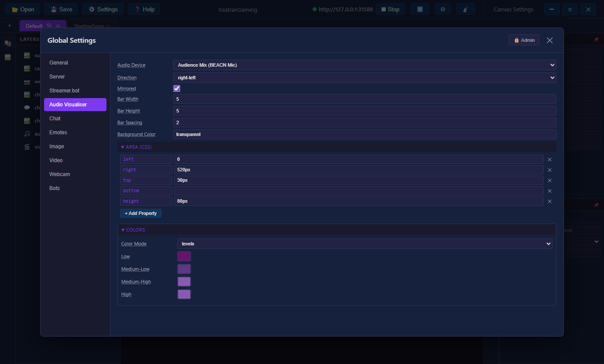

# Audio Visualiser

The audio visualiser renders frequency bars from a microphone/audio input in real-time.

## How It Works

The visualiser captures audio from a specific device via the browser's Web Audio API. It needs:
1. A microphone/audio device specified in the OBS Browser Source URL
2. Microphone permission granted in the browser source

## Setup

### 1. Configure in the Editor

Go to **Settings → Server** and select your audio device from the dropdown. This is typically your desktop audio capture device (e.g. "CABLE Output" if using VB-Audio, or "Stereo Mix").

<!-- SCREENSHOT: Server settings showing audio device dropdown with devices listed -->


### 2. Copy the URL

The generated URL includes the `?microphone=DeviceName&allowaudio=true` parameters. Copy it and use it as your OBS Browser Source URL.

### 3. OBS Browser Source Settings

- Set the URL to the one copied from the editor
- Width: 1920, Height: 1080 (or your resolution)
- **Important**: The first time, you may need to interact with the page to grant microphone access. Open the URL in a regular browser first and allow the microphone.

## Configuration

### Direction

```javascript
direction: "right-left"  // Bars fill from right to left
```

Options: `"left-right"`, `"right-left"`, `"top-down"`, `"bottom-up"`

### Mirrored

```javascript
mirrored: true  // Bars grow from center outward (both directions)
```

### Bar Sizing

```javascript
barWidth: 5,      // Width of each bar in pixels
barSpacing: 2     // Gap between bars in pixels
```

### Colors — Level Mode

Each bar is coloured based on its intensity:

```javascript
colors: {
    mode: "levels",
    level1: "#67136f",  // Low (0-25%)
    level2: "#5c3886",  // Medium-low (25-50%)
    level3: "#885ab4",  // Medium-high (50-75%)
    level4: "#885ab4"   // High (75-100%)
}
```

### Colors — Gradient Mode

Each bar gets a gradient fill along its length:

```javascript
colors: {
    mode: "gradient",
    gradient: {
        stops: [
            { position: 0, color: "#33ccff" },
            { position: 0.5, color: "#000030" },
            { position: 1, color: "#ff99cc" }
        ]
    }
}
```

Use the **Gradient Editor** in Settings → Audio Visualiser to design gradients visually.

<!-- SCREENSHOT: Gradient editor overlay with color stops and live preview bar -->


### Area Positioning

```javascript
area: {
    left: "0",
    right: "0",
    top: "0",
    bottom: null,
    height: "80px"
}
```

Supports pixels (`"80px"`) and percentages (`"50%"`).

## Troubleshooting

### No bars showing
- Check that the audio device name in the URL exactly matches the device label
- Make sure microphone permission is granted
- Verify audio is actually playing through that device

### "No audio device" error in overlay
- The URL is missing the `?microphone=` parameter
- Use the Server settings in the editor to generate the correct URL

### Bars not moving
- The selected audio device might not be receiving audio
- Try a different device (e.g. "Stereo Mix" or a virtual cable output)
