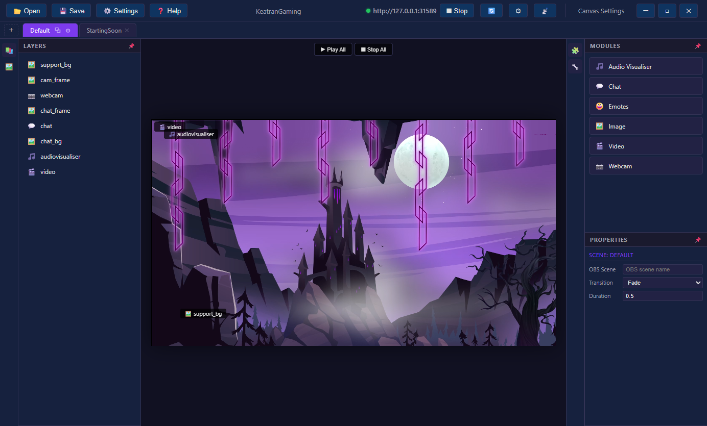

# Editor Guide

## Layout Overview

<!-- SCREENSHOT: Full editor window with labels pointing to: toolbar, scene tabs, layers panel, canvas, modules panel, properties panel, media panel -->

The editor has these main areas:

- **Toolbar** (top) — Open/Save, Settings, server controls, canvas size
- **Scene Tabs** (below toolbar) — Switch between scenes, add new ones
- **Left Sidebar** — Layers panel and Media library
- **Canvas** (center) — Visual workspace where you position modules
- **Right Sidebar** — Modules palette and Properties panel
- **Play/Stop Controls** (above canvas) — Preview animations

## Working with Scenes

### Creating a Scene
Click the **+** button on the left of the scene tabs bar.

### Switching Scenes
Click a scene tab to switch to it. Each scene has its own module layout.

### Scene Settings
Select any module, then look at the **Scene Settings** section in Properties:
- **OBS Scene** — The OBS scene name that triggers this layout
- **Transition Type** — Fade or None
- **Duration** — Transition time in seconds

### Deleting a Scene
Click the **✕** on a scene tab (can't delete the last scene).

## Adding Modules

### From the Palette
Drag a module from the **Modules** panel (right sidebar) onto the canvas.

### From Media Library
Drag an image or video from the **Media** panel directly onto the canvas. It automatically creates the right module type and sets the source.

### From Your Computer
Drag image/video files from Windows Explorer directly onto the canvas. They get uploaded to the media library and added as modules.

## Editing Modules

### Moving
Click and drag a module on the canvas to reposition it.

### Resizing
Select a module, then drag the handles on its edges/corners.

### Properties
Select a module to see its properties in the right sidebar:
- **ID** — Editable name for identifying the module
- **Position & Size** — X, Y, Width, Height (also editable by typing)
- **Module-specific settings** — Source file, opacity, fit mode, etc.

### Module Settings
Click the **⚙️ [Type] Settings** button in Properties to open the full settings panel for that module type (chat styling, visualiser config, etc.)

## Layer Order

The **Layers** panel (left sidebar) shows all modules in the current scene:
- Top of list = rendered on top (highest z-index)
- Bottom of list = rendered behind

### Reordering
- **Drag and drop** layers to reorder
- Use **▲ ▼** buttons on hover
- **🗑** button to delete

## Previewing

### Individual Modules
Select a module and click the **▶** play button (top-right of the module) to start its simulation.

### All at Once
Click **▶ Play All** above the canvas to start all simulations simultaneously. Click **⏹ Stop All** to reset.

<!-- SCREENSHOT: Editor with Play All active showing chat messages flowing, emotes bouncing, and visualiser animating -->

## Media Library

The **Media** panel (left sidebar) manages your uploaded files:

- **📁 Upload** — Browse for files to add
- **📂 New Folder** — Create subdirectories for organisation
- **Drag & Drop** — Drop files from your computer onto the panel
- **Click** a file to select it (when a module needs a source)
- **🗑** on hover to delete

Files are stored in `www/media/` and referenced as `/media/filename.ext` in the config.

## Saving

- **⚡ Save** — Quick save to the current file
- **💾 Save As** — Save to a new location
- **Ctrl+S** — Keyboard shortcut for save
- When the server is running, saving automatically reloads all connected OBS browser sources

## Undo/Redo

- **Ctrl+Z** — Undo
- **Ctrl+Y** — Redo
- Works for module moves, resizes, additions, deletions, and setting changes
