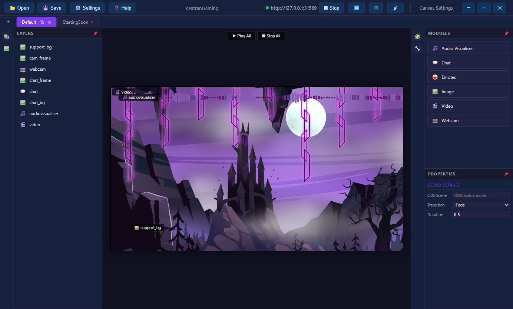

# Getting Started

## Installation

1. Download the latest installer from the [Releases page](../../releases)
2. Run `CanvasUI Setup x.x.x.xxx.exe`
3. Choose your install location and complete the setup
4. Launch **CanvasUI Stream Manager** from your desktop or start menu

## First Launch

When you first open the app:

<!-- SCREENSHOT: Fresh install showing the editor with default empty scene and server running -->


1. The web server starts automatically (green dot in the toolbar)
2. A default scene is created for you
3. The app is ready to serve overlays to OBS

## Adding to OBS

1. In the app toolbar, note the server URL (e.g. `http://127.0.0.1:31589`)
2. In OBS, add a new **Browser Source**
3. Set the URL to the one shown in the app
4. Set width to `1920` and height to `1080` (or your stream resolution)
5. Check "Control audio via OBS" if using the audio visualiser

### Audio Visualiser Setup

If you want the audio visualiser:

1. Go to **Settings → Audio Visualiser**
2. Set the `device` property to your audio capture device name (e.g. "Stereo Mix", "CABLE Output", or your interface's output)
3. Save the config
4. Make sure your OBS Browser Source URL includes `?allowaudio=true`:
   ```
   http://127.0.0.1:31589?allowaudio=true
   ```

<!-- SCREENSHOT: Settings Audio Visualiser tab showing device property -->


## Setting Up Your Channel

1. Click ⚙️ **Settings** in the toolbar
2. Go to the **General** tab
3. Enter your **Channel Name** and **Twitch ID**
4. Go to the **Streamer.bot** tab and set your WebSocket port (default: 24585)
5. Go to the **Bots** tab and add any bot usernames you want hidden from chat

## Next Steps

- [[Editor Guide]] — Learn how to design scenes
- [[Streamer.bot Setup]] — Connect chat and emotes
- [[Audio Visualiser]] — Configure the visualiser
